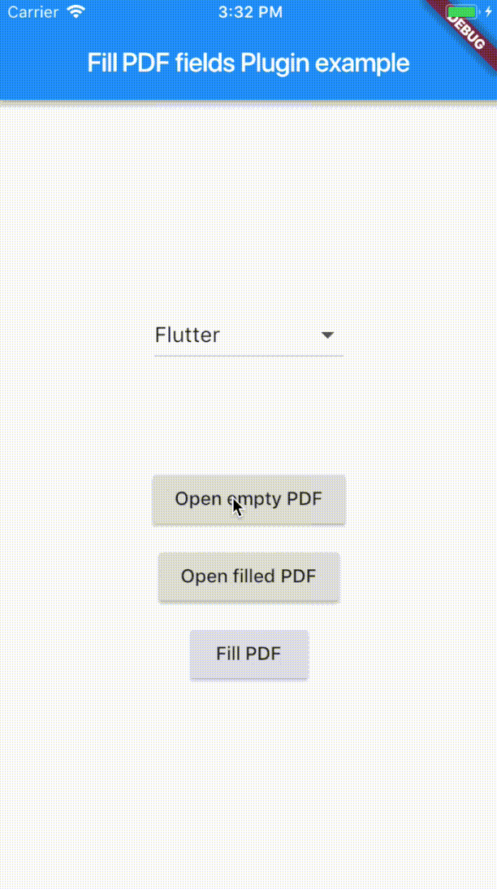

# Plugin to fill/retrieve PDF fields

This plugin allows to fill fields from PDF documents and export the result in a new file. The plugin is also able to extract all the fields' content of a given PDF.



## Compatibility

On Android, the plugin is using the [iTextPDF v5 library](https://itextpdf.com/) and is compatible with all Android versions (API 16+).

On iOS, the plugin is using PDFKit and is thus limited to iOS 11.

## Getting started

### How it works

This plugin has two features :
- Read the content of a PDF file and extract all the fields with their values
- Fill the fields of a PDF and export the result in a new file (always in the filesystem)

### Source

The Dart API allows you to pick a file from :
- the Flutter project resources, 
- the app resources (Android/iOS),
- or the filesystem

#### Android permissions 

On Android, please add the following permissions to your `AndroidManifest.xml`:

```xml
// Only required if you want to read the content of PDF stored in the filesystem
<uses-permission android:name="android.permission.READ_EXTERNAL_STORAGE" />

// Only required if you want to create a PDF in the filesystem
<uses-permission android:name="android.permission.WRITE_EXTERNAL_STORAGE" />
```

### Your Flutter application

Firstly, please import the plugin:

```dart
import 'package:fillable_pdf_form/fillable_pdf_form.dart';
```

Then please follow the example to use the right method.

