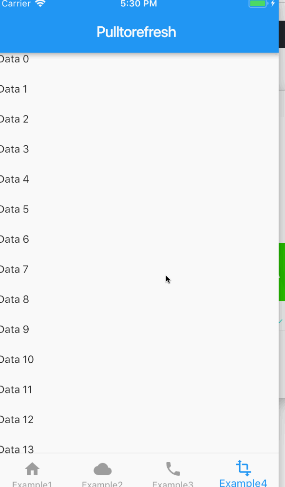

# flutter_pulltorefresh

## 介绍
一个提供上拉加载和下拉刷新的组件,同时支持Android和Ios(暂停维护，等到12月尾考研结束后继续，期间有问题的请issue，到时统一处理)


## 特性
* 同时支持Android,IOS
* 提供上拉加载和下拉刷新
* 几乎适合所有的部件,例如GridView,ListView,Container...
* 高度扩展性和很低的限制性
* 灵活的回弹能力


## 截图

<br>


## 我该怎么用?
1.第一步,在你的pubspec.yml声明

```

   dependencies:
     pull_to_refresh: ^1.1.6
     
```

2.然后,导入,SmartRefresher是一个组件包装在你的外部,child就是你的内容控件

```


   import "package:pull_to_refresh/pull_to_refresh.dart";
     ....

     build() =>

      new SmartRefresher(
          enablePullDown: true,
          enablePullUp: true,
          onRefresh: _onRefresh,
          onOffsetChange: _onOffsetCallback,
          child: new ListView.builder(

                               itemExtent: 40.0,
                               itemCount: data.length,
                               itemBuilder: (context,index){
                                 return data[index];
                               },

          )
      )

```

3.你应该要根据不同的刷新模式状态下,显示不同的布局.当然,
 我这里已经构造了一个指示器方便使用,叫做ClassicIndicator,
 如果不符合要求,也可以选择自己定义一个指示器

```


    Widget _buildHeader(context,mode){
     return new ClassicIndicator(mode: mode);
    }


    Widget _buildFooter(context,mode){
      // the same with header
      ....
    }

    new SmartRefresher(
       ....
       footerBuilder: _buildFooter,
       headerBuilder: _buildHeader
    )


```

4.
无论是顶部还是底部指示器,onRefresh都会被回调当这个指示器状态进入刷新状态。
但我要怎么把结果告诉SmartRefresher,这不难。内部提供一个Controller,通过contrleer.
sendBack(int status)就可以告诉它返回什么状态。

```

  void _onRefresh(bool up){
  		if(up){
  		   //headerIndicator callback
  		   new Future.delayed(const Duration(milliseconds: 2009))
                                 .then((val) {
                                   _refreshController.sendBack(true, RefreshStatus.failed);
                             });

  		}
  		else{
  			//footerIndicator Callback
  		}
      }
  
```


## 属性表
SmartRefresher:

| Attribute Name     |     Attribute Explain     | Parameter Type | Default Value  | requirement |
|---------|--------------------------|:-----:|:-----:|:-----:|
| child      | 你的内容部件   | ? extends ScrollView   |   null |  必要
| headerBuilder | 头部指示器构造  | (BuildContext,RefreshMode) => Widget  | null | 如果你打开了下拉是必要,否则可选 |
| footerBuilder | 尾部指示器构造     | (BuildContext,RefreshMode) => Widget  | null | 如果你打开了上拉是必要,否则可选 |
| enablePullDown | 是否允许下拉     | boolean | true | 可选 |
| enablePullUp |   是否允许上拉 | boolean | false | 可选 |
| onRefresh | 进入刷新时的回调   | (bool) => Void | null | 可选 |
| onOffsetChange | 它将在超出边缘范围拖动时回调  | (double) => Void | null | 可选 |
| controller | 控制内部状态  | RefreshController | null | optional |
| headerConfig |  这个设置会影响你使用哪种指示器,config还有几个属性可以设置   | Config | RefreshConfig | optional |
| footerConfig |  这个设置会影响你使用哪种指示器,config还有几个属性可以设置     | Config | LoadConfig | optional |
| enableOverScroll |  越界回弹的开关,如果你要配合RefreshIndicator(material包)使用,有可能要关闭    | bool | true | optional |

RefreshConfig:

| Attribute Name     |     Attribute Explain     |  Default Value  |
|---------|--------------------------|:-----:|
| triggerDistance      | 触发刷新的距离   |   100.0 |
| completeDuration | 返回成功和失败时的停留时间     |  800 |
| visibleRange | 指示器的可见范围(刷新状态)    |  50.0 |

LoadConfig:

| Attribute Name     |     Attribute Explain     |  Default Value  |
|---------|--------------------------|:-----:|
| triggerDistance      | 加载的触发距离   |   5.0 |
| autoLoad | 是否打开自动进入加载   |  true |
| bottomWhenBuild | 是否加载时处于listView最底部(当你的header是LoadConfig)    |  true |

## FAQ
* <h3>是否支持单纯RefreshIndicator(material)+上拉加载并且没有弹性的刷新组合?</h3>
可以,只要设置节点属性enableOverScroll = false, enablePullDown = false,在外面包裹一个是否支持
单纯RefreshIndicator就可以了,demo里
[example4](https://github.com/peng8350/flutter_pulltorefresh/blob/master/example/lib/ui/Example4.dart)已经给出了例子

* <h3>是否支持不跟随列表的指示器?</h3>
这个我没有在库里面封装，因为就算我封装了,只会让代码逻辑复杂度增加,所以需要你自己利用onOffsetChange
这个回调方法来实现,不难,利用Stack这个东西来封装,具体可以参考[Example](https://github.com/peng8350/flutter_pulltorefresh/blob/master/example/lib/ui/Example3.dart)   或者我的项目
[flutter_gank](https://github.com/peng8350/flutter_gank) 也有实现的思路

*<h3>为什么child属性从原来widget扩大到scrollView?</h3>
因为本人疏忽的原因,没有考虑到child需要缓存里面的item的问题,所以1.1.3版本已经修正不能缓存的问题

* <h3>这个库会不会对性能造成什么影响?<br></h3>
应该不会,虽然我没有实际用数据来测试性能问题,但是我在另一个项目开发过程中,并没有出现上拉或下拉滑动卡顿情况。

* <h3>有办法实现限制越界回弹的最大距离吗?/h3>
答案是否定的,我知道肯定是要通过修改ScrollPhysics里面的来实现,但我对里面的Api不太明白,尝试过但失败了。如果
你有办法解决这个问题的话,请来个PR


## 开源协议
 
```
 
MIT License

Copyright (c) 2018 Jpeng

Permission is hereby granted, free of charge, to any person obtaining a copy
of this software and associated documentation files (the "Software"), to deal
in the Software without restriction, including without limitation the rights
to use, copy, modify, merge, publish, distribute, sublicense, and/or sell
copies of the Software, and to permit persons to whom the Software is
furnished to do so, subject to the following conditions:

The above copyright notice and this permission notice shall be included in all
copies or substantial portions of the Software.

THE SOFTWARE IS PROVIDED "AS IS", WITHOUT WARRANTY OF ANY KIND, EXPRESS OR
IMPLIED, INCLUDING BUT NOT LIMITED TO THE WARRANTIES OF MERCHANTABILITY,
FITNESS FOR A PARTICULAR PURPOSE AND NONINFRINGEMENT. IN NO EVENT SHALL THE
AUTHORS OR COPYRIGHT HOLDERS BE LIABLE FOR ANY CLAIM, DAMAGES OR OTHER
LIABILITY, WHETHER IN AN ACTION OF CONTRACT, TORT OR OTHERWISE, ARISING FROM,
OUT OF OR IN CONNECTION WITH THE SOFTWARE OR THE USE OR OTHER DEALINGS IN THE
SOFTWARE.

 
 ```
