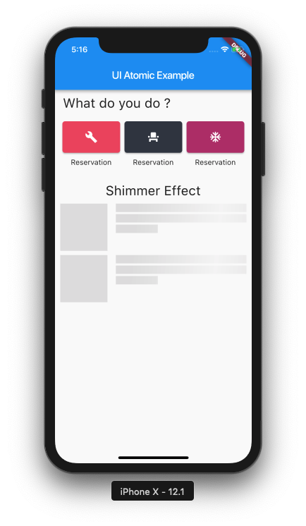

# ui_atomic

An UI Packages for building UI across Android & iOS based on Atomic Design

## About



* Version: 0.0.4
* Compatible: sdk: ">=2.0.0-dev.68.0 <3.0.0"

This framework contains 3 directory. It's common, ios, android. Every directory based on atomic(color, font color, font style, etc) and molecule(label, text, field, etc), organism(custom box, custom field, etc), and templates(custom section, custom listview, etc).

## Getting Started

This project is a starting point for a Dart
[package](https://flutter.io/developing-packages/),
a library module containing code that can be shared easily across
multiple Flutter or Dart projects.

For help getting started with Flutter, view our 
[online documentation](https://flutter.io/docs), which offers tutorials, 
samples, guidance on mobile development, and a full API reference.

## Usage
##Custom Section
```
body: Container(
        child: Column(
          children: <Widget>[
            CustomSectionView(title: 'What do you do ?',)
          ],
        ),
      ),
```
##Custom Box
```
        Row(
            mainAxisAlignment: MainAxisAlignment.spaceEvenly,
            children: <Widget>[
              Expanded(
                  child: CustomBoxSection(
                title: 'Reservation',
                height: 60,
                width: 110,
                color: ColorsStyle.baraRed,
                boxIcon: Icon(
                  Icons.build,
                  color: Colors.white,
                ),
              )),
              Expanded(
                  child: CustomBoxSection(
                title: 'Reservation',
                height: 60,
                width: 110,
                color: ColorsStyle.mainColor,
                boxIcon: Icon(
                  Icons.event_seat,
                  color: Colors.white,
                ),
              )),
              Expanded(
                  child: CustomBoxSection(
                title: 'Reservation',
                height: 60,
                width: 110,
                color: ColorsStyle.veryBerry,
                boxIcon: Icon(
                  Icons.ac_unit,
                  color: Colors.white,
                ),
              )),
            ],
          )
```


